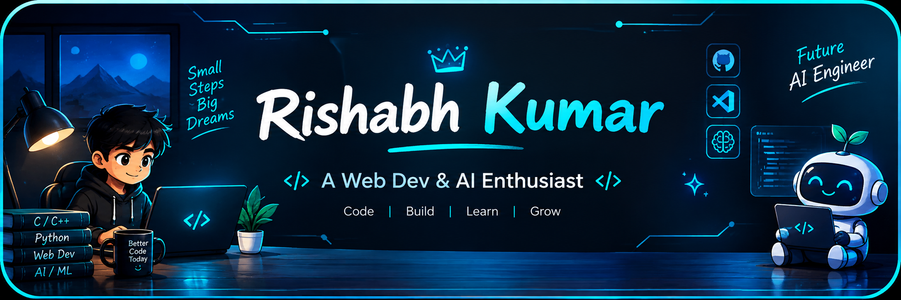

<div align="center">



# 👋 Hey there! I'm Rishabh Kumar

### <i>Computer Science Student • Aspiring AI Engineer • Tech Enthusiast</i>

📍 Naya Raipur, Chhattisgarh, India
🎓 B.Tech in Computer Science & Engineering — ITM University, Naya Raipur

</div>

<div align="center">


</div>

<div align="center">


</div>

<div align="center">


</div>

---

<div align="center">

## 👨‍💻 About Me

</div>

* 🎓 B.Tech Computer Science & Engineering student at **ITM University, Naya Raipur**
* 📚 Currently pursuing my **1st Semester**
* 💻 Building strong foundations in **programming and problem solving**
* 🤖 Interested in **Artificial Intelligence and Machine Learning**
* 🌐 Exploring **Web Development and Software Development**
* ⚙️ Interested in **Automation and Developer Tools**
* 🚀 Learning by building practical projects
* 🎯 Long-term goal: **AI Engineer**

<div align="center">


</div>

---

<div align="center">

## 💡 What I Do

| Area                    | Focus                                              |
| ----------------------- | -------------------------------------------------- |
| 💻 **Programming**      | C • C++ • Python • JavaScript                      |
| 🧠 **Problem Solving**  | Programming logic and problem-solving fundamentals |
| 🌐 **Web Development**  | HTML • CSS • JavaScript • React • Tailwind CSS     |
| ⚙️ **Backend**          | Node.js • Express.js                               |
| 🤖 **AI / ML**          | Currently learning AI/ML fundamentals              |
| ✨ **Generative AI**     | Currently exploring                                |
| 🔧 **Automation**       | Exploring automation and AI-powered workflows      |
| 🚀 **Project Building** | Learning by building practical applications        |

</div>

---

<div align="center">

## 🛠️ My Tech Arsenal

### 💻 Programming Languages


### 🌐 Web Development


### ⚙️ Backend & Database


### 🔧 Tools


### 🤖 AI / Machine Learning

**Currently Learning:**

Artificial Intelligence • Machine Learning Fundamentals • Generative AI • AI-powered Applications

</div>

---

<div align="center">

## 🚀 Featured Projects

</div>

### 🤖 AI Tools Hub

A web platform for discovering, searching, filtering and exploring AI tools across different categories.

**Tech Stack:** React • Vite • Tailwind CSS • JavaScript

* 🔎 AI tool discovery
* 🗂️ Categories and filtering
* ⭐ Favorites
* 🌙 Dark / Light mode
* 📱 Responsive interface

🔗 **GitHub:** Add your actual repository link
🌐 **Live Demo:** Add your actual deployed link

---

### 🌐 Personal Portfolio

A personal portfolio website showcasing my profile, skills, projects and development journey.

**Portfolio:**
https://rishabh-singh-in.netlify.app/

---

### 💻 C Programming Practice

A collection of C programming exercises created while building programming fundamentals.

**Topics:** Variables • Operators • Conditions • Loops • Arrays • Functions • Pointers

---

<div align="center">

## 📚 Currently Learning

```text
C Programming
      ↓
C++ & Data Structures
      ↓
Python
      ↓
Web Development
      ↓
AI / ML Fundamentals
      ↓
Generative AI
      ↓
AI Engineering
```

</div>

---

<div align="center">

## 🎓 Education

### ITM University, Naya Raipur

**B.Tech — Computer Science and Engineering**

📚 Current Semester: **1st Semester**
🎯 Expected Graduation: **2030**

</div>

---

<div align="center">

## 🏆 Achievements & Certifications

</div>

Currently focused on building strong fundamentals and practical projects.

This section will be updated as I complete:

* 🎓 Technical certifications
* 💻 Coding competitions
* 🚀 Hackathons
* 🏆 Awards and achievements
* 📚 Relevant technical courses

**No major achievements added yet — building toward them.**

---

<div align="center">


## 🔥 GitHub Streak


</div>

<div align="center">


## 🌐 Let's Connect!

[](https://www.linkedin.com/in/rishabh-kumar-885b5a420/)

[](https://github.com/Rishabh-code-ITM)

[](https://rishabh-singh-in.netlify.app/)

</div>

---

<div align="center">

### 🎯 My Long-Term Goal

**To become an AI Engineer and build practical AI-powered software, intelligent applications and real-world AI/ML solutions.**

<br>

<em>Learning • Building • Improving — one step at a time.</em>

</div>

<div align="center">


<b>Thanks for visiting my profile! 🚀</b>


</div>

<div align="center">


</div>
